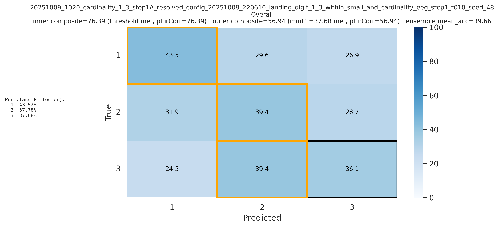

# EEG Deep Learning for Numerical Cognition

A deep learning pipeline for decoding numerical representations from 128-channel EEG data, investigating the neural signatures of the Parallel Individuation (PI) and Approximate Number System (ANS) during numerical change detection.

## Scientific Motivation

### The Two-Systems Hypothesis

Cognitive neuroscience proposes two distinct systems for processing quantities:

1. Parallel Individuation (PI) / Object File System:
   - Processes small numbers (1-3) via "subitizing": rapid, precise enumeration
   - Limited capacity of ~3-4 objects
   - Linked to visual short-term memory and object tracking

2. Approximate Number System (ANS):
   - Processes larger numbers (4 or 5+) via magnitude estimation
   - Weber's law: discrimination depends on numerical ratio
   - Imprecise representations as overlapping Gaussian distributions

### Research Questions

This project asks: Can we decode individual numerosities from trial-level EEG data using deep learning? Specifically:
- Do neural signatures distinguish numerosities within and across the PI/ANS boundary?
- Can we identify the "border" between the two systems from decoding performance?
- How do neural patterns differ for increasing vs. decreasing numerical changes?
- Can we decode not just change detection, but specific landing digits (which number participants saw)?

## Study Background

This project uses data from a 2023 doctoral dissertation (Tang-Lonardo, Columbia University) that examined numerical change detection using traditional ERP analysis. We apply deep learning to the expanded dataset (N=24, 6,480 trials) to decode individual numerosities from single-trial EEG patterns. The original ERP study (N=15) found N1 amplitudes scaled with small numbers but plateaued for large numbers, and P3b latencies mirrored reaction times.

Data collection: 128-channel EEG recorded during an oddball task where participants detected numerical changes (1-6 dots). Example trial: 4 → 4 → 4 → 6 (participant presses spacebar on "6").

## What This Pipeline Does

This repository implements a deep learning pipeline for EEG decoding with:
- Subject-aware nested cross-validation (prevents data leakage)
- Three-stage automated hyperparameter search (Optuna TPE)
- Multiple decoding objectives: cardinality classification, landing digit identification
- Explainable AI: Integrated Gradients with brain topographic maps
- Statistical rigor: permutation testing, deterministic seeding, full audit trails

We train convolutional neural networks (EEGNeX architecture) directly on raw EEG epochs to classify:
1. Which numerosity range (1-3, 4-6)
2. Which specific landing digit (e.g., "was it 2 or 3?")
3. Combined cardinality + landing digit tasks

## Preliminary Results

Summary: The models reliably classify several two-class contrasts (e.g., specific small numerosity pairs, change vs. no-change) above chance, while three-way and six-way tasks are more fragile and reveal substantial individual variability. Contrasts that include "one" are the most robust, suggesting that oneness has a more distinct neural pattern than other numerosities in this dataset.

### Three-Way Classification: Numerosities 1, 2, 3 (PI Range)

Confusion Matrix (Leave-One-Subject-Out, N=24)


Overall test accuracy: 39.7% (chance: 33.3%). Class "1" shows strongest performance (F1: 43.5%), while classes "2" and "3" are more frequently confused with each other. The model achieves above-chance discrimination within the subitizing range, but performance is fragile. "One" appears to have the most distinctive neural signature, consistent with the special status of oneness in numerical cognition literature.

Key observations:
- Class "1" correctly classified 43.5% of the time (best performance)
- Classes "2" and "3" show substantial confusion (31.9% and 39.4% overlap)
- Composite objective: 56.94 (min-F1: 37.7%, plurality correctness: 56.9%)

### Binary Classification: Distinguishing Landing Digits 2 vs 3

Confusion Matrix (Leave-One-Subject-Out, N=24)


Overall test accuracy: 55.6% (chance: 50%). Both classes show balanced F1 scores (~55%), demonstrating above-chance single-trial decoding of fine-grained numerical distinctions within the subitizing range. This binary contrast is more robust than the three-way task, suggesting that "2" and "3" produce distinguishable neural signatures when isolated from "1".

### Hyperparameter Optimization

Convergence:


Optuna's TPE sampler rapidly identifies high-performing architectures, reaching composite objective >98 on inner validation within ~10 trials.

Importance Analysis:


Temporal augmentation parameters (`time_mask_p`, `time_mask_frac`) dominate model performance, suggesting that time-domain invariance is critical for generalization. This aligns with ERP findings showing time-varying neural dynamics during numerical processing.

## Supported Tasks

The pipeline currently supports 7 decoding tasks:

Cardinality Tasks (binary/ternary classification by range):
- `cardinality_1_3`: Classify numerosities in the PI range (1 vs 2 vs 3)
- `cardinality_4_6`: Classify numerosities in the ANS range (4 vs 5 vs 6)
- `cardinality_1_6`: Six-way classification across both systems (1-6)

Landing Digit Tasks (identify the specific target numerosity):
- `landing_on_2_3`: Binary classification (2 vs 3) within PI range
- `landing_digit_1_3_within_small`: Ternary classification of landing digit (1/2/3)
- `landing_digit_1_3_within_small_and_cardinality`: Combined task (includes no-change trials)
- `landing_digit_4_6_within_large_and_cardinality`: Combined task for ANS range (4/5/6 + no-change)

Task naming convention: Tasks reflect the cognitive hypothesis being tested (e.g., can we decode which digit within the small range, not just that a change occurred).

## Key Features

- Leak-Free Validation: Subject-aware splits ensure no participant data appears in both train and test
- Constitutional Rigor: No silent fallbacks (all parameters must be explicitly specified)
- Three-Stage Optuna Search: Progressive refinement (architecture, recipe, augmentation)
- Composite Objectives: Balance decodability (min-per-class F1) and distinctness (plurality correctness)
- Explainable AI: Integrated Gradients reveal which channels/timepoints drive predictions
- Permutation Testing: Generate empirical null distributions with fixed splits
- Full Provenance: Every run logs model class, library versions, hardware, seeds, hyperparameters
- Publication-Ready: Automated figure generation meeting neuroscience journal standards

## Quick Start

### Installation

```powershell
# Clone repository
git clone https://github.com/yourusername/eeg_nn.git
cd eeg_nn

# Create conda environment
conda env create -f environment.yml
conda activate eegnex-env

# Optional: Enable PDF report generation
playwright install
```

### Basic Usage

```powershell
# 1. Prepare data (one-time conversion from HAPPE-cleaned EEGLAB .set files)
python scripts/prepare_from_happe.py

# 2. Run a single LOSO evaluation (Leave-One-Subject-Out)
python -X utf8 -u train.py \
  --task cardinality_1_3 \
  --engine eeg \
  --base configs/tasks/cardinality_1_3/base.yaml

# 3. Run hyperparameter search (Stage 1: architecture exploration)
python -X utf8 -u scripts/optuna_search.py \
  --stage step1 \
  --task cardinality_1_3 \
  --base configs/tasks/cardinality_1_3/base.yaml \
  --cfg configs/tasks/cardinality_1_3/step1_search.yaml \
  --space configs/tasks/cardinality_1_3/step1_space_scaffold.yaml \
  --trials 48

# 4. Generate explainability analysis (topomaps, time-frequency, attributions)
python -X utf8 -u scripts/run_xai_analysis.py \
  --run-dir "results\runs\<run_dir_name>"
```

## Data Requirements

Input data structure:
- EEG: HAPPE-preprocessed EEGLAB `.set` files (128-channel EGI system)
  - Preprocessed with 0.3-30 Hz bandpass filter
  - Artifact rejection and spherical spline interpolation
  - 500ms epochs (-100ms to +400ms relative to stimulus onset)
- Behavioral: Trial-level CSV files with columns:
  - `SubjectID`, `Block`, `Trial`, `Procedure`, `Condition`
  - `Target.ACC` (accuracy), `Target.RT` (reaction time)
  - Derived columns: `direction` (increasing/decreasing), `size` (small/large), `change_group`
- Montage: 128-channel sensor positions (`net/AdultAverageNet128_v1.sfp`) for topoplot generation

See [Data Preparation Guide](docs/DATA_PREPARATION.md) for detailed preprocessing steps.

## Documentation

- [Quick Start Guide](docs/QUICK_START.md) - Get running in 5 minutes
- [Configuration Reference](docs/CONFIGURATION.md) - Complete configuration options
- [CLI Reference](docs/CLI_REFERENCE.md) - All command-line tools
- [Workflows](docs/WORKFLOWS.md) - Common usage patterns (multi-seed, permutation testing)
- [XAI Guide](docs/XAI_GUIDE.md) - Explainability analysis (Integrated Gradients, topomaps)
- [Optuna Guide](docs/OPTUNA_GUIDE.md) - Hyperparameter optimization strategies
- [Statistics Guide](docs/STATISTICS.md) - Post-hoc analysis (GLMM, permutation tests)
- [Data Preparation](docs/DATA_PREPARATION.md) - Preprocessing pipeline details
- [Technical Details](docs/TECHNICAL_DETAILS.md) - Implementation specifics
- [Architecture](docs/ARCHITECTURE.md) - Repository organization
- [Troubleshooting](docs/TROUBLESHOOTING.md) - Common issues and solutions

## Reproducibility

This project implements multiple safeguards to ensure scientific validity:

- Determinism: Strict seeding (Python/NumPy/PyTorch/CUDA), `torch.use_deterministic_algorithms(True)`
- Subject-Aware Splits: GroupKFold/LOSO with assertions preventing subject leakage
- Nested Cross-Validation: Inner K-fold for hyperparameter selection, outer fold for unbiased test evaluation
- Provenance Tracking: Every run logs model architecture, library versions, hardware specs, determinism flags
- Audit Trails: Exports split indices, per-trial predictions, learning curves, checkpoint metadata
- Permutation Testing: Empirical null distributions with fixed split structure (label shuffling only)
- Constitutional Requirements: All critical parameters must be explicitly specified (no silent fallbacks)
- Objective-Aligned Pruning: Early stopping and checkpoint selection use the same metric as hyperparameter optimization

## Repository Structure

```
eeg_nn/
├── code/                       # Core implementation
│   ├── training/              # Modular training orchestration
│   │   ├── setup_orchestrator.py
│   │   ├── inner_loop.py
│   │   ├── outer_loop.py
│   │   └── evaluation.py
│   ├── artifacts/             # CSV writers, plot builders
│   ├── preprocessing/         # MNE pipeline, spatial sampling
│   ├── datasets.py            # EEG data loaders
│   ├── model_builders.py      # EEGNeX architecture
│   └── training_runner.py     # Thin coordinator
├── configs/                    # YAML configuration files
│   ├── common.yaml            # Global defaults
│   └── tasks/                 # Per-task configs (base, search spaces)
├── scripts/                    # Command-line entry points
│   ├── train.py
│   ├── optuna_search.py
│   ├── run_xai_analysis.py
│   └── run_posthoc_stats.py
├── docs/                       # Detailed documentation
├── results/                    # Training outputs, Optuna studies
│   ├── runs/                  # Individual training runs
│   └── optuna/                # Hyperparameter search databases
├── publication-ready-media/    # Figures meeting journal standards
└── data_preprocessed/          # Materialized .fif epochs (gitignored)
```

## Citation

If you use this code or approach in your research, please cite:

```
[Citation to be added upon manuscript submission]

This project extends: Tang-Lonardo, J. E. (2023). The Neurobehavioral Basis
of the Parallel Individuation and Approximation Number System [Doctoral
dissertation, Columbia University].
```

## Contributing

This project is part of ongoing graduate research at Teachers College, Columbia University. For questions, collaboration inquiries, or bug reports, please:
- Open an issue on GitHub
- Contact: mkg2145@tc.columbia.edu

## License

MIT License - see LICENSE file for details.

## Acknowledgments

- Theoretical Foundation: Tang-Lonardo, J. E. (2023), PI/ANS neurobehavioral study
- EEG Preprocessing: [HAPPE](https://github.com/PINE-Lab/HAPPE) pipeline
- Deep Learning Framework: [Braindecode](https://braindecode.org/) (EEGNeX model)
- Hyperparameter Optimization: [Optuna](https://optuna.org/) (TPE sampler)
- Explainability: [Captum](https://captum.ai/) (Integrated Gradients)
- Neuroimaging Tools: [MNE-Python](https://mne.tools/) (EEG analysis, topoplots)
